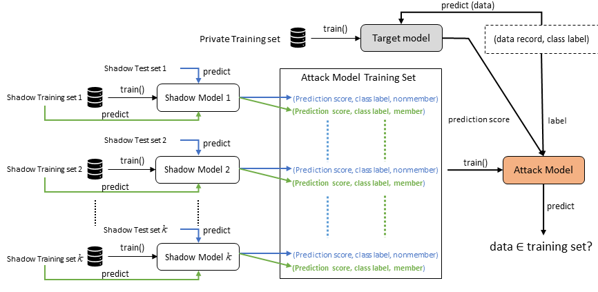

# The Impact of Synthetic Data on Membership Inference Attacks

> This repository contains the official implementation of the paper: The Impact of Synthetic Data on Membership Inference Attacks

---

## Abstract

Privacy of machine learning on Big Data has become a prominent issue in recent years due to the increased availability and usage of sensitive personal data to train the models. Membership inference attacks are one such issue that has been identified as a major privacy threat against machine learning models. Several techniques including applying differential privacy have been advocated to mitigate the effectiveness of inference attacks, however, they come at a cost of reduced utility/accuracy. Synthetic data is one approach that has been widely studied as a tool for privacy preservation recently but not much yet in the context of membership inference attacks. In this work, we aim to deepen the understanding of the impact of synthetic data on membership inference attacks. We compare models trained on original versus synthetic data, evaluate different synthetic data generation methods, and study the effect of overfitting in terms of membership inference attacks. Our investigation reveals that training on synthetic data can significantly reduce the effectiveness of membership inference attacks compared to models trained directly on the original data. This also holds for highly overfitted models that have been shown to increase the success rate of membership inference attacks. We also find that different synthetic data generation methods do not differ much in terms of membership inference attack accuracy but they do differ in terms of utility (i.e., observed based on train/test accuracy). Since synthetic data shows promising results for binary classification-based membership inference attacks on classification models explored in this work, exploring the impact on other attack types, models, and attribute inference attacks can be of worth. 

  

---

# Paths

|Path | Description
| :--- | :---
├── data
│   ├── Adult | Original and synthetic datasets required for Adult
│   ├── Avila | Original and synthetic datasets required for Avila
│   ├── Location | Original and synthetic datasets required for Location-30
│   └── Polish | Original and synthetic datasets required for Polish
├── model
│   ├── ..... | Placeholder for trained models
├── LICENSE | Apache 2.0 License
├── mi_attack_adult.ipynb | Code related to MIA on Adult dataset 
├── mi_attack_avila.ipynb | Code related to MIA on Avila dataset
├── mi_attack_location.ipynb | Code related to MIA on Location-30 dataset 
├── mi_attack_polish.ipynb | Code related to MIA on Polish dataset 
├── mia_arch.png | MI attack overview image 
├── mia_models.py | Library functions for MIA
└── README.md

---

# Acknowledgement
I would like to thank Navoda Senavirathne for sharing the code from publication [1] which was reused in this repository. The authors name is mentioned before all the functions that are resused from the following repositury

Github link of Navodas repository: https://github.com/navodas/MIA

---

# References

[1] Navoda Senavirathne and Vicenç Torra. 2021. Dissecting Membership Inference Risk in Machine Learning. In Cyberspace Safety and Security: 13th International Symposium, CSS 2021, Virtual Event, November 9–11, 2021, Proceedings. Springer-Verlag, Berlin, Heidelberg, 36–54. https://doi-org.focus.lib.kth.se/10.1007/978-3-030-94029-4_3

